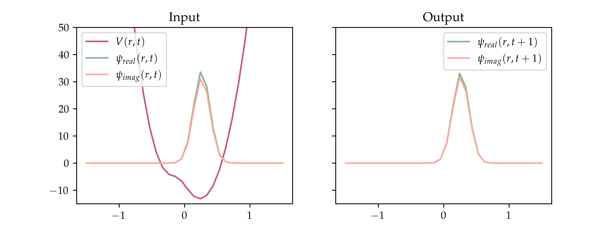

# LSTM to solve the Time Dependent Schrödinger Equation

We implemented an LSTM model in PyTorch to propagate wave packets under certain kinds of time-dependent potentials through time.

## Table of Contents
1. [Data Generation](#datagen)
2. [Architecture of the LSTM model](#arch)
3. [Training](#training)
4. [Results and Predictions](#results)
5. [Previous Works](#prevw)
6. [About Physical System](#phys)

## Data Generation 📊
LSTM model uses wave packet and potential at time $t$ as input and returns the wave packet at time $t+ \Delta t$ under potential given. We used an LSTM model because we view this problem as a time series problem.

To generate wave packets $\psi(r,t)$ propagated through time we applied the DVR method to solve the Time Dependent Schrödinger Equation, using the *Proton Transfer System* as model of potential. We used a grid of $n=32$ points in the position space $[a=-1.5, b=1.5]\mathring{A}$, each step of time was $\Delta t= 1 fs$, and generated trajectories of $200fs$ (this is the sequence of length to the LSTM). The next figure shows an example of what contains one trajectory.

The notebook to generate data is in `src/Proton_Transfer_DataGenerate.ipynb` and contains a guide to use the class.

## Architecture 🛠️
The processing of data, details of the LSTM model, and all the steps of the training and testing are in the notebook:  `src/ANN_models/LSTM-Model2.ipynb`.

### Summary of model:

| Layers | Features | Input/Output |
|--------|----------|--------------|
| LSTM   | 1024     | (96,1024)    |
| LSTM   | 1024     | (1024,1024)  |
| Linear | 64       | (1024,64)    |

## Training 💪

| Training data     | Validation data   |
| ----------------- | ----------------- |
| 5600 trajectories | 1600 trajectories |
 
- Loss function: MSE
- Optimiser: AdamW, weight_decay=0.01
- learning rate: 1e-4
- batch size: 10
- epochs: 290

## Results and Predictions 📈
The trained model was saved in: `src/ANN_Models/4700Data_LSTM_MODEL2/14-05-23_10EPOCHS.pth`   

To compare our results, we used $|S|$ and $\theta$ parameters of the accuracy function:  
$$S=\langle \psi_{LSTM}|\psi_{True}\rangle = |S|e^{i \theta}$$     
which compares the two wavefunction, the expected $\psi_{True}$ and the predicted with the LSTM model $\psi_{LSTM}$. If we have two equal wavefunction, given that they are normalised, it follows that:   
$$\langle \psi|\psi\rangle = \int_a^b dr\psi(r) \psi(r)^\dagger = \int_a^b|\psi(r)|dr = 1 = |S|e^{i\theta} \iff |S|=1\text{ and }\theta=0$$     
We obtained an average magnitude accuracy of $|S|=0.946$ and an average phase accuracy of $\theta=0.0001$  over a test set with 800 trajectories. The next figures shows some predictions by LSTM model.   

## Previous Works 📖
 [Artificial Neural Networks as Propagators in Quantum Dynamics](https://doi.org/10.1021/acs.jpclett.1c03117)
 

## About the Chemical-Physical System ⚛
> [!note]
>  This is probably a very physical approach 😸
 

